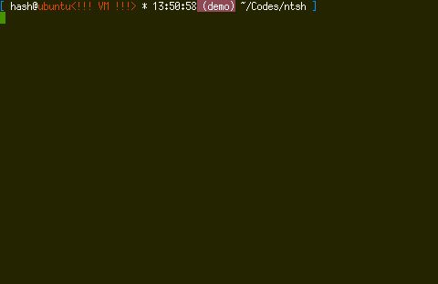

# aft3rmath

    LKM that hides itself and system processes without relying on syscall hooking.

## Usage

    Commands are sent to /proc/aft3rmath as ROOT, exemple:
        echo hide >/proc/aft3rmath

    hide:  hide the module from lsmod/rmmod. Key to unhide is output from ring buffer
        echo hide >/proc/aft3rmath
        dmesg

    <key>: unhide the module
        echo "<random key from ring buffer>" >/proc/aft3rmath

    <PID>: hide/unhide process. Suppose there is a PID 28172
        hide:
            echo 28172 >/proc/aft3rmath
        unhide if the process is hidden:
            echo 28172 >/proc/aft3rmath

    list: list hidden processes via ring buffer
        echo list >/proc/aft3rmath
        dmesg

    The LKM can only be unloaded if it is not hidden

